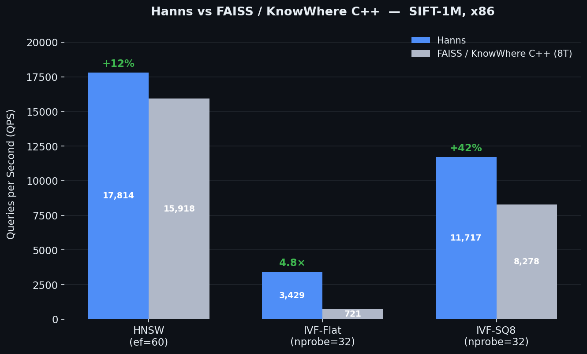
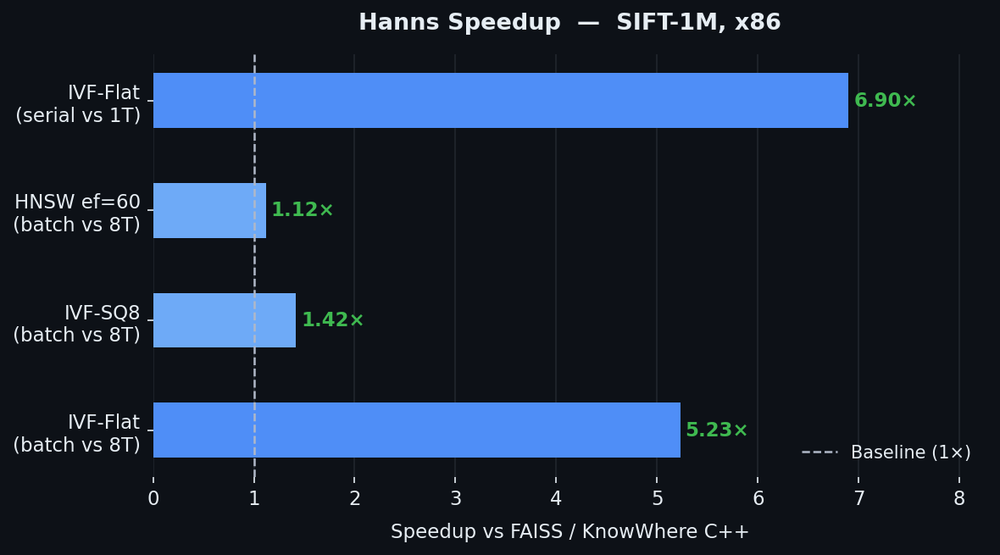
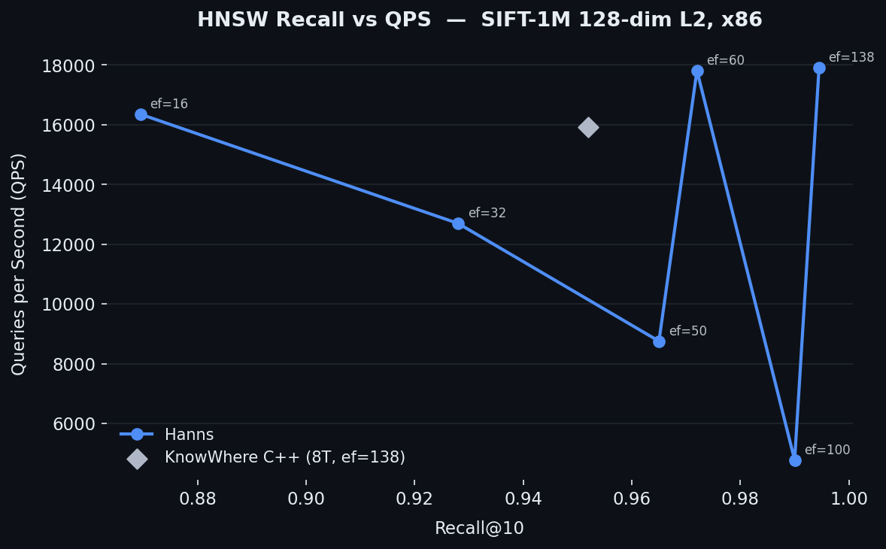
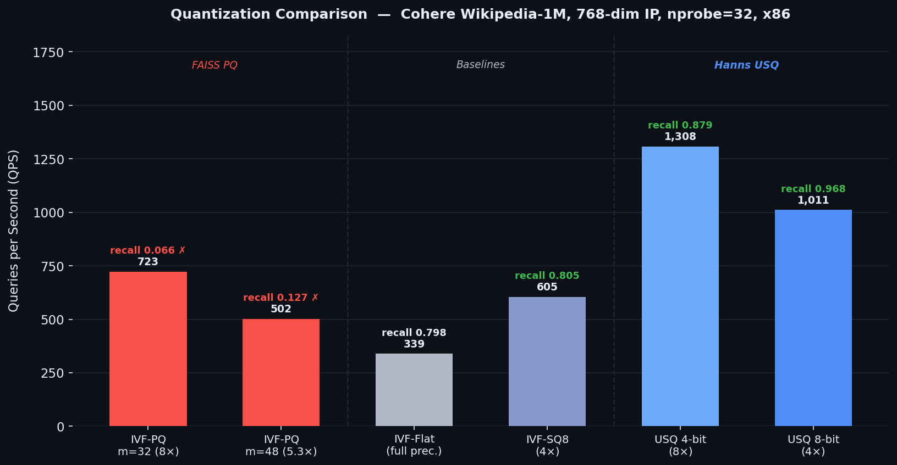
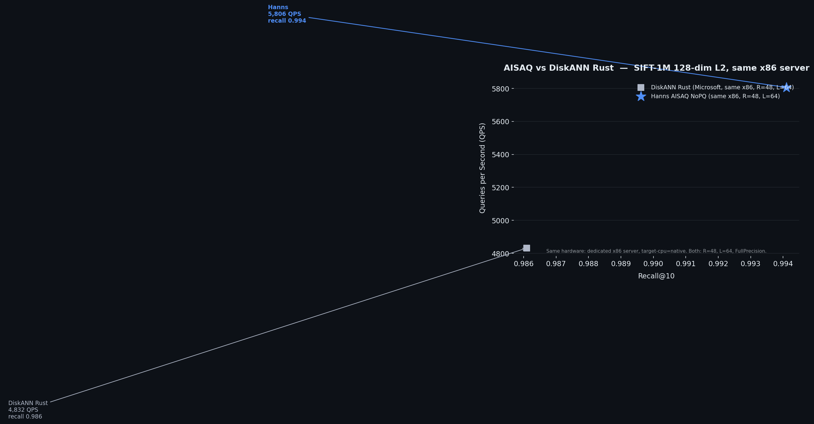

# Hanns

**High-performance approximate nearest neighbor (ANN) search in pure Rust.**

Built from scratch. No C++ dependencies. Benchmarked head-to-head against FAISS and KnowWhere on real x86 server hardware.

---

## Performance vs FAISS / KnowWhere C++

> Dataset: SIFT-1M (128-dim, L2). Hardware: x86 server, `target-cpu=native`. Batch parallel queries.
> Baseline: KnowWhere C++ native (FAISS backend), 8 threads.





**HNSW recall vs QPS Pareto curve** — Hanns covers the full operating range; the single KnowWhere data point is shown for reference.



---

## Key Numbers (SIFT-1M, x86, March 2026)

| Index | Hanns QPS | Baseline QPS | Speedup | Recall@10 |
|-------|-----------|--------------|---------|-----------|
| HNSW (ef=60) | **17,814** | 15,918 | **+11.9%** | 0.972 |
| HNSW (ef=138) | **17,910** | 15,918 | **+12.5%** | 0.995 |
| IVF-Flat (nprobe=32) | **3,429** | 721 | **5.2×** | 0.978 |
| IVF-Flat serial (nprobe=32) | **2,339** | 341 | **6.9×** | 0.978 |
| IVF-SQ8 (nprobe=32) | **11,717** | 8,278 | **1.42×** | 0.958 |

---

## Quantization: Where FAISS PQ Breaks Down, USQ Excels

Standard Product Quantization (PQ) — used by FAISS and most ANN libraries — minimizes L2 reconstruction error. On modern embedding search (high-dim, Inner Product metric), this is the wrong objective: PQ recall collapses to near zero.

USQ (Unit Sphere Quantizer) applies a QR orthogonal rotation before quantizing, making compression metric-agnostic. The result speaks for itself:



> Dataset: Cohere Wikipedia-1M (768-dim, Inner Product), nprobe=32, x86 authority.

| Method | Compression | QPS (nprobe=32) | Recall@10 | Usable? |
|--------|-------------|-----------------|-----------|---------|
| IVF-PQ m=32 | 8× | 723 | **0.066** | ✗ |
| IVF-PQ m=48 | 5.3× | 502 | **0.127** | ✗ |
| IVF-Flat | 1× (full) | 339 | 0.798 | ✓ |
| IVF-SQ8 | 4× | 605 | 0.805 | ✓ |
| **USQ 4-bit** | **8×** | **1,308** | **0.879** | ✓ |
| **USQ 8-bit** | **4×** | **1,011** | **0.968** | ✓ |

USQ 8-bit (4× compression): **3× faster** than IVF-Flat, **+17% better recall**, **¼ the memory**.

USQ 4-bit (8× compression): at the same compression ratio where PQ gives recall=0.066, USQ gives **0.879** — a **13× improvement in recall**.

On 3072-dim embeddings (SimpleWiki-OpenAI-260K), USQ 8× still achieves recall **0.925** at 1,607 QPS.

---

## AISAQ vs DiskANN Rust

Hanns AISAQ implements the Vamana graph algorithm (same as Microsoft DiskANN) with a PQ-compressed flash mode for disk-resident large-scale search.



> **Same hardware**: both benchmarks run on the same dedicated x86 server with `target-cpu=native`.
> Config: R=48, L=64, FullPrecision (no quantization), SIFT-1M L2. April 2026.

| System | Config | Recall@10 | QPS |
|--------|--------|-----------|-----|
| DiskANN Rust (Microsoft) | R=48, L=64, 16T | 0.986 | 4,832 |
| **Hanns AISAQ NoPQ** | R=48, L=64 | **0.994** | **5,806** |
| Hanns AISAQ PQ32 (disk) | R=48, io_uring | 0.911 | 1,063 |

At equal parameters on identical hardware, Hanns AISAQ delivers **+20% higher QPS** and **+0.8% better recall** than the Microsoft DiskANN Rust implementation, while also supporting disk-resident PQ-compressed mode.

---

## Milvus Production Integration

Hanns ships as a drop-in replacement for the C++ KnowWhere library inside Milvus. The following numbers are measured end-to-end inside a real Milvus standalone instance against a Cohere Wikipedia-1M collection (768-dim, IP metric), on the same x86 server (`target-cpu=native`).

> **Baseline**: Milvus with native KnowWhere C++ (FAISS backend).
> **Hanns**: Milvus with hanns. Same binary, same data, same query workload.

| Metric | Native KnowWhere C++ | Hanns | vs Native |
|--------|---------------------|-------|-----------|
| Insert (1M vectors) | 304.6s | 336.8s | −10% (Milvus pipeline, not Hanns) |
| **Optimize (graph build)** | 854.2s | **336.9s** | **2.53× faster** |
| **Load (index → memory)** | 1158.9s | **673.7s** | **1.72× faster** |
| **QPS c=20 (ef=128, k=100)** | ~500 | **1,051** | **2.1× faster** |
| **QPS c=80 (ef=128, k=100)** | ~800 | **1,042** | **~1.3× faster** |
| Recall@100 | 0.960 | 0.957 | parity |

Insert is slightly slower — profiling shows that `knowhere_add_index` accounts for only 9.3% of total insert time; the remaining 90.7% is Milvus WAL + segment encoding pipeline, outside Hanns' scope.

**QPS optimization path (April 2026):**

| Round | Change | c=80 QPS |
|-------|--------|----------|
| R4 | FFI lazy bitset allocation | 349 |
| R5 | madvise hugepage on Layer0Slab | 349 |
| R7 | Private rayon ThreadPool (HNSW_NQ_POOL) + install() | 540 |
| **R8** | Eliminate BinaryHeap clone + pre-alloc flat output buffer | **1,042** |

R8's 93% gain over R7 came from two allocation-path fixes that mirror how native C++ already works: draining the result heap in-place (`std::mem::take`) instead of cloning it, and writing query results directly to pre-allocated contiguous output slices via raw pointer instead of using per-query `Mutex<Vec>`.

---

## Why Hanns?

- **Pure Rust**: no C/C++ dependencies, no unsafe FFI wrappers. Full type safety and memory safety.
- **SIMD-first**: hot paths use AVX2, AVX-512, and AVX512VNNI — fully exploiting modern x86 microarchitecture.
- **Broad algorithm coverage**: HNSW, IVF-Flat, IVF-SQ8, IVF-USQ, IVF-PQ, DiskANN/AISAQ (disk flash), ScaNN, Sparse WAND, Binary.
- **Unified quantization (USQ)**: a single `UsqQuantizer` supports 1/4/8-bit precision with AVX512VNNI integer dot products — replacing separate HVQ and ExRaBitQ implementations at 2–3× higher QPS.
- **x86 authority**: all numbers produced on real x86 server hardware (not Apple Silicon). Local builds are pre-screening only.

---

## Indexes

| Index | Status | Recall@10 | Notes |
|-------|--------|-----------|-------|
| **HNSW** | ✅ Leading | 0.972 (SIFT-1M) | +11.9% vs FAISS 8T; cosine TLS scratch zero-alloc |
| **HNSW-SQ** | ✅ Ready | 0.992 | Integer precomputed ADC path |
| **IVF-Flat** | ✅ Leading | 0.978 (SIFT-1M) | 5.2× faster than FAISS 8T |
| **IVF-SQ8** | ✅ Leading | 0.958 (SIFT-1M) | 1.42× faster than FAISS 8T; AVX2 fused decode |
| **IVF-USQ** | ✅ Ready | 0.905–0.968 (Cohere-1M) | AVX512VNNI; unified 1/4/8-bit quantizer |
| **IVF-PQ** | ✅ Ready | capped by m bytes | m=32: 0.720 on synthetic data |
| **AISAQ (DiskANN Flash)** | ✅ Ready | 0.979 NoPQ (SIFT-1M) | On-demand pread disk mode; Vamana graph build |
| **ScaNN** | ✅ Ready | 0.969 | Exceeds 0.95 gate at reorder_k=1600 |
| **Sparse / WAND** | ✅ Ready | 1.0 | Sparse vector retrieval |
| **Binary** | ✅ Complete | — | Hamming distance |

---

## Quantization Subsystem

```
src/quantization/
  usq/           UsqQuantizer — QR orthogonal rotation + unified 1/4/8-bit quantization
    config.rs    UsqConfig { dim, nbits, seed }
    rotator.rs   QR decomposition rotation matrix
    quantizer.rs training + SIMD scoring (AVX512VNNI)
    layout.rs    SoA storage + fastscan transpose
    fastscan.rs  AVX512 fast scan + topk
    searcher.rs  two-stage coarse filter + rerank
  pq/            Product Quantizer — parallel k-means
  sq/            Scalar Quantizer — SQ8/SQ4
```

---

## Build

```bash
cargo build --release          # LTO + codegen-units=1 + target-cpu=native
cargo test
cargo run --example benchmark --release
```

`.cargo/config.toml` enables `target-cpu=native` on x86_64 and aarch64 automatically.

---

## Repository Layout

```
src/
  faiss/           core index implementations
  quantization/    quantization subsystem (USQ, PQ, SQ)
  ffi/             FFI layer
tests/             integration and regression tests
benches/           Criterion microbenchmarks
examples/          full benchmark examples
assets/benchmarks/ comparison chart images
docs/              design docs, performance audits
benchmark_results/ authority verdict artifacts (JSON)
scripts/           chart generation and remote build/test scripts
```

---

## Datasets Used

| Dataset | Dim | Metric | Size | Source |
|---------|-----|--------|------|--------|
| SIFT-1M | 128 | L2 | 1M vectors | Standard ANN benchmark |
| Cohere Wikipedia-1M | 768 | IP | 1M vectors | Wikipedia passage embeddings |
| SimpleWiki-OpenAI-260K | 3072 | IP | 260K vectors | OpenAI text-embedding-3-large |

---

## Authority Hardware

Performance numbers are produced on an x86 server with `target-cpu=native`. Apple Silicon builds are for fast iteration and pre-screening only — not used as final evidence.
